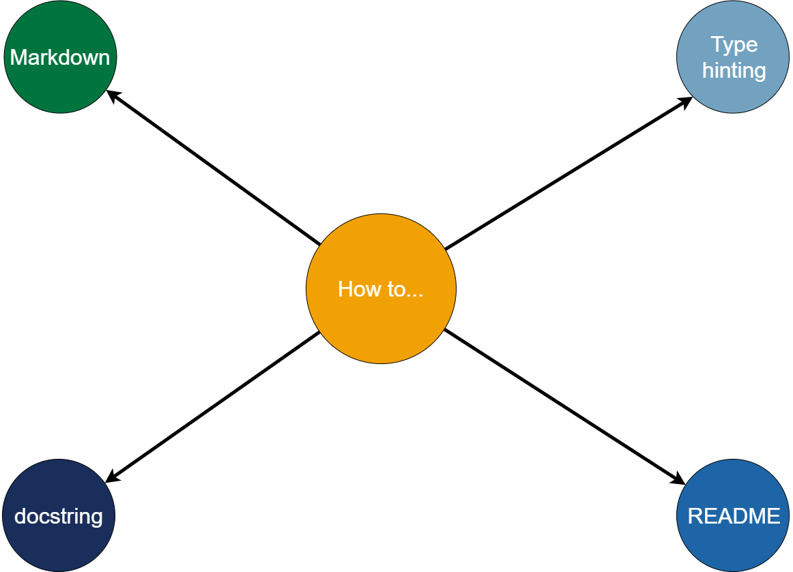

# HOW TO...

> 🐱‍💻 This markdown file contains information on how to write different things.

Within this markdown it will be explained how to write different type of things. These mostly contain Python code, or refer to general rules of writing (for instance markdown or READMEs).

</img>

- [HOW TO...](#how-to)
  - [Markdown](#markdown)
- [Header 1](#header-1)
  - [Header 2](#header-2)

## Markdown

> 💌 In this paragraph the basics of markdown will be demonstrated.

Markdown is a typesetting language, which is widely used to write README.md, stackoverflow.com questions or other documents. It contains the basic type settings, like:

```code``` (`` ` code ``` - just delete the first space in the apostrophes)

When using these three apostrophes you can also specify which language you will type. For that you just name the language after the three apostrophes.

**bold** (** bold **, __ bold __)

*italic* (* italic *, _ italic _)

[hyperlink](www.google.de) ([text] (link))

With the hashtag, we can create different levels of headers. E.g.

# Header 1

## Header 2

As you can see, these are also displayed in the table of content.

We can create enumerated lists with the numbers
1. This is the first entry
2. This is the second

We can create normal lists with the minus sign
- This is the first bullet point
- This the second

We can also make a separator, using three minus signs in a row

---


Markdown also supports HTML-tags. However, GitHub, does only accept specific ones. [Here](https://gist.github.com/seanh/13a93686bf4c2cb16e658b3cf96807f2) are a few.

