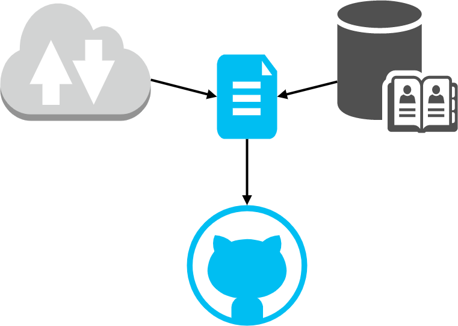

# References

> 📚 This README explains how we will handle our collaborative literature.

I will explain in the following how I think we should handle collaborative knowledge management.

</img>

- [References](#references)
  - [resources.md - File](#resourcesmd---file)
  - [references.bib - File](#referencesbib---file)
    - [Update .bib file in Overleaf](#update-bib-file-in-overleaf)

**DO NOT UPLOAD ANY BOOKS OR PAPERS TO GITHUB, SINCE THIS MIGHT VIOLATE COPYRIGHTS!!!**

## resources.md - File

> 📝 This paragraph explains how to use the .txt file

The [resources.md](resources.md) contains links to useful webpages and to articles which might be restricted to your student access rights. When you are reading an article, which you either cite or where you take ideas from, please insert them into this list, under restricted access. The section helpful resources is a bit more self-explaining. Please always provide a short sentence about the topic of this link.

## references.bib - File

> 📓 This paragraph will explain how to use a .bibtex file for collaborative scientific working

In order to later work together collaboratively in our paper, we will use a .bib file. Whatever software you use for knowledge managment (e.g. Citavi, Zotero, ...), they all can import a .bib file. This file contains detailed information about a book, article or whatever form science comes in. When you added new resources using your own favorite tool (e.g. Citavi, Zotero, ...), please export the .bib file again, and upload it to the github. 

### Update .bib file in Overleaf

To update the .bib file in Overleaf just delete it and reupload it. Just ensure, that you added contents, and not deleted them by accident.